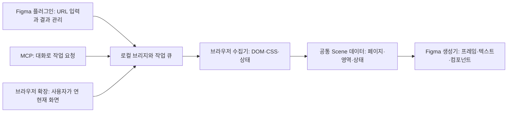

# figmaize 공개 제품 설계

상태: 로컬 프로토타입과 공개 준비 문서. GitHub 소스 공개 대상은 parktaesu123/figmaize이며 코드 라이선스는 MIT입니다. npm/Figma Community 배포와 일반 사용자용 URL 입력 UI는 아직 완료하지 않았습니다.

## 제품의 중심

**웹사이트 URL을 넣으면 Figma 안에 편집 가능한 페이지·컴포넌트·상태가 정리되는 도구.** Figma 플러그인을 기본 인터페이스로 제공하고 MCP는 같은 작업을 대화로 호출하는 선택 인터페이스로 둡니다. AI 구독이나 특정 MCP 클라이언트를 제품의 필수 조건으로 만들지 않습니다.

최초 1회 로컬 수집기를 설치한 다음 Figma에서 URL → 수집 범위 → 결과 확인 순서로 사용하게 합니다. 매번 모든 내부 페이지와 버튼 조합을 수집하지 않습니다. 기본은 현재 페이지와 주요 상태이며, 선택한 내부 페이지와 전체 사이트 수집은 추가 옵션으로 제공합니다.

사용자 흐름:

1. 플러그인 실행 → 로컬 수집기 연결 상태 확인.
2. URL 입력 → 현재 페이지 / 선택한 페이지 / 사이트 전체 중 선택.
3. 화면 크기, 메뉴·팝업 포함 여부, 페이지·화면 한도 표시.
4. 검색된 페이지 목록에서 대상 확인 후 가져오기.
5. 진행률과 완료/제외/실패를 구분해 표시. 중단 후 이어받기.
6. 사이트별 컬렉션에서 텍스트·버튼·레이아웃을 편집.

## 하나의 제품, 세 가지 내부 역할



플러그인 샌드박스에 Chromium 실행을 넣지 않고 로컬 수집기가 페이지를 렌더링합니다. MCP와 Figma UI가 별도 수집 엔진을 구현하지 않도록 동일한 job service를 호출하게 합니다. 초기에는 기존 `server/`, `shared/`, `figma/`, `extension/` 구조를 유지하고, 안정화 후 필요할 때 패키지를 나눕니다.

| 역할 | 현재 코드 | 공개 전 보완 |
| --- | --- | --- |
| 수집 엔진 | capture-url, site-capture, DOM collector | 실제 취소 신호, browser closed 시 빠른 종료, 동적 콘텐츠 대기 |
| Scene/상태 정리 | shared/schema, compact-site | 안정적인 요소 식별, 범위별 차이, 반복 요소 중복 제거 |
| Figma 생성 | importer, bridge-ui | 직접 URL 입력, 사이트 선택, 진행률, 부분 실패 복구 UI |
| MCP | stdio server, site-jobs | UI와 공유하는 작업 서비스, 컬렉션 조회/취소/재개 도구 |
| 배포 | build script, 개발 manifest | 일반 Node/Chromium 설치, 진단 CLI, 릴리스 패키지 |

로컬 MCP에는 stdio를 사용합니다. [MCP 공식 서버 가이드](https://modelcontextprotocol.io/docs/develop/build-server)를 기준으로 클라이언트 호환성 검증을 추가합니다.

## 사이트와 상태의 구조

```text
Site: example.com
  Page: /products
    대표 화면
    Header / 메뉴 상태
    Product card / 기본·선택·펼침
    Dialog / 열림
  Page: /pricing
    대표 화면
    Billing / 월간·연간
```

컬렉션은 origin + 사용자가 선택한 경로 + viewport + 수집 ID로 구분합니다. 다른 사이트의 결과를 같은 컬렉션에 합치지 않습니다. Figma의 기존 사용자 페이지는 보존하며, 목적지를 선택하게 합니다. 사이트별 Figma 페이지 자동 생성은 별도 구현 항목입니다.

현재 가능한 것: 페이지별 부모 프레임과 기능별 중첩 상태, 변경 영역 잘라 표시하기, 네이티브 텍스트·버튼 컴포넌트, 측정 좌표가 맞는 Auto Layout.

추가 구현: 반복 버튼을 공유 main component + instance로 통합, 확실히 대응되는 상태만 Variant로 구성, 선택적 프로토타입 연결. 현재 결과는 별도 상태 프레임이며 실제 ComponentSet/Variant나 작동하는 웹 애플리케이션으로 간주하지 않습니다.

페이지 전체를 상태마다 복제하지 않는 원칙은 유지하되, 변경 영역을 확신할 수 없으면 충분한 문맥을 남깁니다. 기존 작업 재정리는 레이어 ID와 편집 내용을 보존합니다. 사이트 재수집이 사용자의 Figma 수정 내용을 덮어쓰지 않도록 교체 대상을 명시해야 합니다.

## 속도와 비용

- DOM/CSS 수집·분류·비교·생성은 프로그램이 처리하며 요소마다 LLM을 호출하지 않습니다.
- AI는 자연어 명령을 작업 옵션으로 바꾸는 역할로 제한합니다. MCP 없이도 동일한 결과를 만들 수 있어야 합니다.
- 콘텐츠 해시로 이미지·동일 상태를 중복 제거하고 수집 결과를 재사용합니다.
- 브라우저 탐색은 제한된 동시성으로, Figma 변형은 순차 실행합니다.
- 새 사이트 하나는 작은 기본 한도로 시작합니다. 전체 크롤링은 사용자가 선택합니다.
- 수집 진행률과 Figma 생성 진행률을 분리합니다. 접수나 queued 상태를 완료로 표시하지 않습니다.

## 토스 사례 분리

- 공개 재현 방법: `examples/toss/README.md`.
- 실제 수집물: `.layer-bridge/sites/toss-en-us/` — 기존 journal과 경로 유지.
- 개인 진행 기록: `.layer-bridge/cases/toss/`.
- 기존 Figma 결과: Toss - en-us 페이지에 보존.
- 공통 엔진의 보고서 제목과 범위는 manifest에서 읽습니다. 토스나 /en-us를 하드코딩하지 않습니다.

공개 데모와 CI에는 자체 제작한 `examples/demo.html`과 테스트 fixture를 사용합니다. 코드 공개물에 토스 이미지나 개인 Figma 파일을 함께 넣지 않습니다.

## 공개 순서

### 1. 작동하는 GitHub alpha

설치 안내, 자체 제작 데모, 테스트, 버전별 변경사항, known limitations를 함께 공개합니다. 첫 버전은 소스 체크아웃 + 개발용 플러그인 + 로컬 Node 프로세스로 재현합니다. macOS 이외 Windows/Linux의 수집기 설치도 확인해야 하며 Figma 실행 환경은 별도 문서화합니다.

일반 사용자가 따라 할 수 있는 설치 경로를 검증한 다음 GitHub Releases에 Figma 개발 플러그인 파일과 버전이 고정된 로컬 수집기를 제공합니다. `npm files` allowlist는 준비됐지만 공개 배포 검증을 완료한 것은 아닙니다.

### 2. 설치 간소화와 npm

계획된 CLI 인터페이스는 `figmaize setup`, `doctor`, `mcp`입니다. **아직 이 명령이나 npm 공개 패키지는 없습니다.** setup은 명시적으로 브라우저 설치를 안내하고, doctor는 Node/Chromium/포트/플러그인 연결 상태를 검사하도록 만듭니다.

현재 런타임의 Codex 번들 fallback은 개발 편의 기능으로만 남깁니다. 공개 설치는 일반 Node + 명시적인 Playwright 의존성 및 브라우저 버전으로 재현합니다. npm 설치 폴더에 캡처 데이터를 쓰지 않도록 사용자 데이터 디렉터리로 이전합니다.

### 3. Figma Community

현재 `layer-bridge-local`과 devAllowedDomains 설정은 개발용입니다. 공개 시 Figma에서 발급한 플러그인 ID와 실제 실행에 필요한 networkAccess, 로컬 서버 접근 설명을 별도 릴리스 manifest에 설정합니다. [공식 manifest 문서](https://developers.figma.com/docs/plugins/manifest/)는 로컬 서버를 allowedDomains에 포함할 경우 reasoning을 요구합니다. [Community 게시 절차](https://help.figma.com/hc/en-us/articles/360042293394-Publish-classic-plugins-to-the-Figma-Community)에 맞춰 검증하며 승인 여부를 미리 보장하지 않습니다.

Community 플러그인 설치만으로 수집이 가능해지는 것은 아닙니다. 로컬 수집기 설치 안내가 여전히 필요합니다. 관리형 원격 수집 서버는 운영비와 데이터 처리 범위가 추가되므로 첫 공개 버전 이후에 판단합니다.

## 라이선스와 저장소 운영

코드는 MIT 라이선스로 공개하며 LICENSE에 조건을 제공합니다. package.json의 private:true는 아직 npm 배포 준비가 끝나지 않았기 때문에 유지합니다. 수집한 웹사이트 콘텐츠는 코드 라이선스의 적용 대상이 아닙니다. 외부 라이브러리·폰트·테스트 자료의 고지는 별도로 확인합니다.

공개 저장소에는 CONTRIBUTING, 이슈 템플릿, 재현 가능한 fixture, CI, 변경 이력과 보안 제보 경로를 준비합니다. 첫 이슈 범위는 설치·레이아웃·텍스트·상태 수집·성능으로 나눕니다. 유지보수 범위를 명확히 하기 위해 로그인 자동화, 폼 제출, 완전한 앱 동작 재현은 첫 버전의 목표에서 제외합니다.

## 공개 alpha의 완료 기준

- 새로운 컴퓨터에서 특정 AI 앱 없이 설치하고 자체 제작한 3개 유형의 페이지를 가져올 수 있음.
- 랜딩 페이지, 대시보드, 카드·탭·모달 페이지에서 편집 가능 여부를 검증함.
- 여러 사이트를 별도 컬렉션으로 관리하고, 상태가 바뀌어도 최상위 화면이 무분별하게 증가하지 않음.
- 취소/재개/연결 끊김 테스트에서 중복 레이어가 생기지 않음.
- 미지원 CSS·대체 폰트·부분 수집을 결과에 명시함.
- 공개 패키지에 연결 코드·캡처 데이터·개인 파일 링크·개인 절대 경로가 없음.
- 라이선스, 게시할 계정/저장소/패키지 이름, 공개 manifest가 확정됨.
